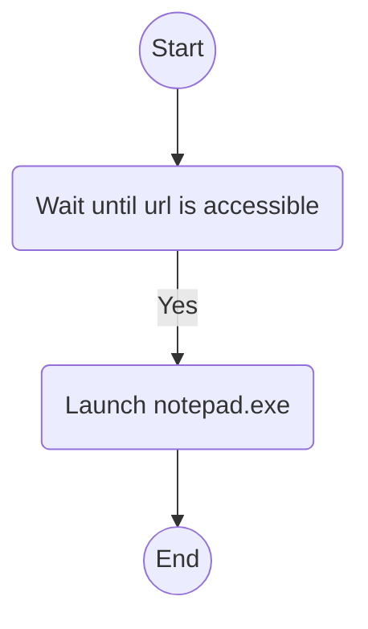
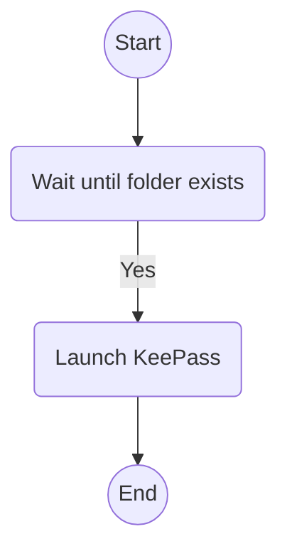
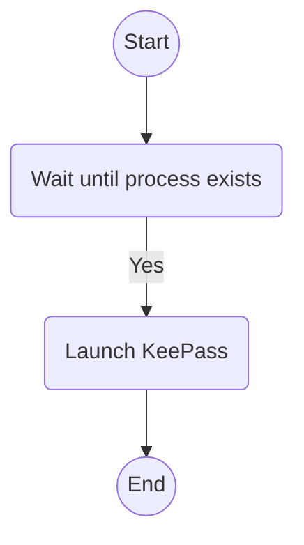
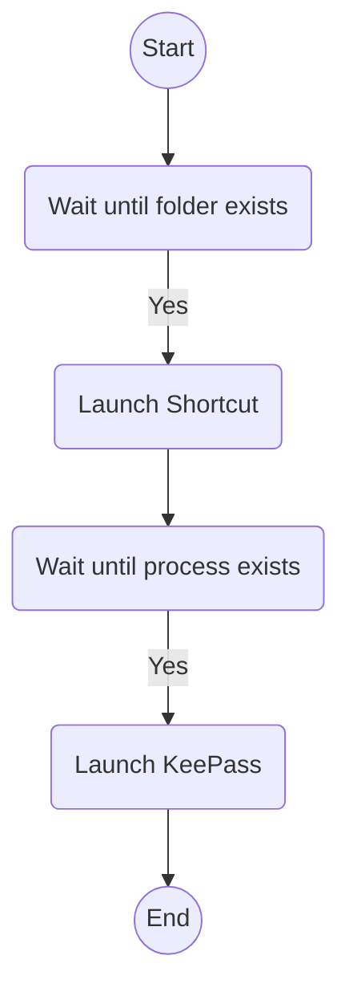

# PSStartProcessAfter

[](https://github.com/PowerShell/PowerShell)
[](https://www.microsoft.com/windows)
[](LICENSE)

⏳ Executes a process after specified conditions are met.
For example, wait for a web request to succeed before executing a process.
Or execute a process after a specified process starts.

## 📋 Requirements

- Windows PowerShell 5.1+

## 📦 Installation

```powershell
# powershell
git clone https://github.com/kumarstack55/PSStartProcessAfter.git
Set-Location .\PSStartProcessAfter\
```

## 🚀 Usage

### Execute a process after a web request succeeds

```powershell
# powershell
Start-ProcessAfter -WaitType "UrlIsAccessible" -WaitFor "https://www.example.com" -CommandLine "notepad.exe"
```

### Execute a process when a folder becomes accessible

```powershell
# powershell
Start-ProcessAfter -WaitType "FolderExists" -WaitFor "$HOME\OneDrive\Personal Vault" -CommandLine "notepad.exe"
```

### Execute a process after another process starts

```powershell
# powershell
Start-ProcessAfter -WaitType "ProcessExists" -WaitFor "notepad" -CommandLine "calc.exe"
```

## ⚙️ Parameters

- WaitType: Specifies the type of condition to wait for

  - `"UrlIsAccessible"`: Wait for URL accessibility
  - `"FolderExists"`: Wait for folder existence
  - `"ProcessExists"`: Wait for process execution

- WaitFor: Specifies the target to wait for (URL, folder path, or process name)

- CommandLine: Command line to execute after the condition is met

- CheckIntervalSeconds: Check interval in seconds (default: 5)

## 🔗 Creating shortcuts

### Helper function to create shortcuts

```powershell
# powershell
$shortcutDirectoryPath = "$env:APPDATA\PSStartProcessAfter\Shortcuts"
New-Item -Path $shortcutDirectoryPath -ItemType Directory -Force | Out-Null
```

```powershell
# powershell

Set-Location .\PSStartProcessAfter\

. .\helpers\New-StartProcessAfterShortcutItem.ps1

$scriptItem = Get-Item .\Start-ProcessAfter.ps1
```

### Example1: Launch notepad after internet is accessible



```powershell
# powershell
$shortcutDirectoryPath = "$env:APPDATA\PSStartProcessAfter\Shortcuts"

$params = @{
    ScriptItem = $scriptItem
    WaitType = "UrlIsAccessible"
    WaitFor = "https://www.example.com"
    CommandLine = "notepad.exe"
    ShortcutDirectoryPath = $shortcutDirectoryPath
    ShortcutBaseName = "StartNotepadAfterUrlIsAccessible"
}

New-StartProcessAfterShortcutItem @params
```

### Example2: Launch KeePass after OneDrive Vault is available



```powershell
# powershell
$shortcutDirectoryPath = "$env:APPDATA\PSStartProcessAfter\Shortcuts"
$oneDriveVaultPath = Join-Path -Path $HOME -ChildPath "OneDrive\Personal Vault"

# Note that you must escape string using double quotes and backslashes here.
$keepassPath = '\"C:\Program Files\KeePass Password Safe 2\KeePass.exe\"'

$params = @{
    ScriptItem = $scriptItem
    WaitType = "FolderExists"
    WaitFor = $oneDriveVaultPath
    CommandLine = $keepassPath
    ShortcutDirectoryPath = $shortcutDirectoryPath
    ShortcutBaseName = "StartKeepassAfterOneDriveVaultIsAvailable"
}

New-StartProcessAfterShortcutItem @params
```

### Example3: Launch keepass after PAGEANT.exe is running



```powershell
# powershell
$shortcutDirectoryPath = "$env:APPDATA\PSStartProcessAfter\Shortcuts"

# Note that you must escape string using double quotes and backslashes here.
$keepassPath = '\"C:\Program Files\KeePass Password Safe 2\KeePass.exe\"'

$params = @{
    ScriptItem = $scriptItem
    WaitType = "ProcessExists"
    WaitFor = "PAGEANT"
    CommandLine = $keepassPath
    ShortcutDirectoryPath = $shortcutDirectoryPath
    ShortcutBaseName = "StartKeepassAfterPageantIsRunning"
}

New-StartProcessAfterShortcutItem @params
```

### Example3: Launch Keepass if the pageant is running and the OneDrive Personal Vault folder exists



```powershell
# powershell
$shortcutDirectoryPath = "$env:APPDATA\PSStartProcessAfter\Shortcuts"

$oneDriveVaultPath = Join-Path -Path $HOME -ChildPath "OneDrive\Perosonal Vault"

# Note that you must escape string using double quotes and backslashes here.
$keepassPath = '\"C:\Program Files\KeePass Password Safe 2\KeePass.exe\"'

$params2 = @{
    ScriptItem = $scriptItem
    WaitType = "FolderExists"
    WaitFor = $oneDriveVaultPath
    CommandLine = $keepassPath
    ShortcutDirectoryPath = $shortcutDirectoryPath
    ShortcutBaseName = "StartKeepassAfterOneDriveVaultIsAvailable"
}
$item2 = New-StartProcessAfterShortcutItem @params2

# Note that escaping is unnecessary here. Since the path contains no spaces, there is no need to enclose it in double quotes.
$commandLine = $item2.FullName

$params1 = @{
    ScriptItem = $scriptItem
    WaitType = "ProcessExists"
    WaitFor = "PAGEANT"
    CommandLine = $commandLine
    ShortcutDirectoryPath = $shortcutDirectoryPath
    ShortcutBaseName = "StartKeepassAfterOneDriveVaultIsAvailableAfterPageantIsRunning"
}
New-StartProcessAfterShortcutItem @params1
```

## LICENSE

MIT
